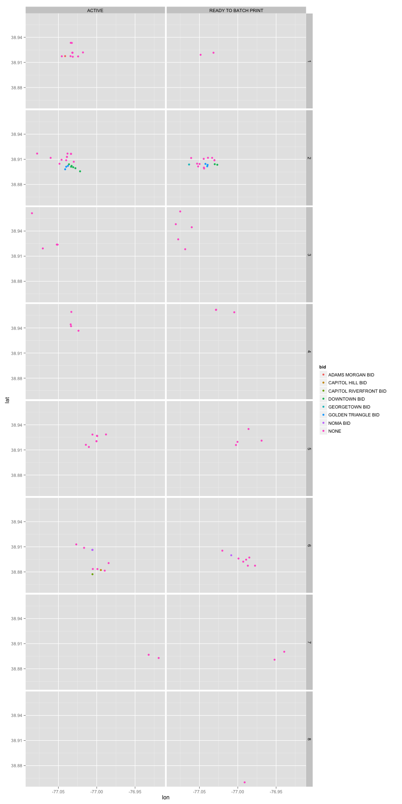

SQL, the Sequel : Data Wranglers DC : August 2014 Meetup
========================================================
**Author:**  [Ryan B. Harvey](http://datascientist.guru)

**Created:** 2014-07-17 / **Last Updated:** 2014-07-18

**Contents:**
- The `sqldf` package: SQL on dataframes in R
- Loading some test data
- Querying and subsetting that test data
- Example of a complex query

**Package Dependencies:**
- **[sqldf](http://cran.r-project.org/package=sqldf):** Perform SQL Selects on R Data Frames. R package version 0.4-7.1. Author: G. Grothendieck (2014) [more info & source](https://code.google.com/p/sqldf/)

**References:**
- This RPub was created for a talk to the Data Wranglers DC meetup group on August 6, 2014.
  - Talk information: [http://www.meetup.com/Data-Wranglers-DC/events/177269432/](http://www.meetup.com/Data-Wranglers-DC/events/177269432/)
  - This is only a portion of the talk, which included database information, SQL code, and an iJulia notebook too.
  - My code, slides and the sample data are all available on Github. [https://github.com/nihonjinrxs/dwdc-august2014](https://github.com/nihonjinrxs/dwdc-august2014)

The `sqldf` package is an R package that creates tables in a local SQLite database, runs the requested SQL query on those tables, and then drops the tables from the SQLite database.  Although this can be slower than subsetting a data frame directly, in cases where the data frame is very complex and conditions get difficult to parse, SQL can provide a straightforward, declarative way of requesting a particular data subset.

If the `sqldf` package doesn't exist in your environment, install the package.  Once you have it, require it.

```r
# install.packages("sqldf")
require(sqldf)
```

```
## Loading required package: sqldf
## Loading required package: gsubfn
## Loading required package: proto
## Loading required package: RSQLite
## Loading required package: DBI
## Loading required package: RSQLite.extfuns
```

Note that the `sqldf` package will use SQLite as a default, unless a different database driver package is currently loaded (i.e., If we would like `sqldf` to use a different database product, we can tell it which driver to use by specifying that in the options statement.

```r
# options(sqldf.driver = "SQLite")
```

For example, if you wanted to use some of the functions available in PostgreSQL, you could use that as the driver for `sqldf` by loading the `RPosgreSQL` package first.  More details on this are at [How does one use sqldf with PosrgreSQL?](https://code.google.com/p/sqldf/#12._How_does_one_use_sqldf_with_PostgreSQL?).

Load some data to work with
---------------------------
For this example, we'll use the [Basic Business Licenses data](http://data.dc.gov/Main_DataCatalog.aspx?id=1520) from the [DC government open data site](http://data.dc.gov/).

The data is available as a zip file, so we'll download it if it's not already available, and then unzip it if it hasn't been already.


```r
url = "http://data.octo.dc.gov/feeds/bbl/bbl_current_csv.zip"
data_dir = "../data/"
current_dir = getwd()
setwd(data_dir)
local_zipped = "bbl_current_csv.zip"
local_data = "bbl_current_csv.csv"
if (!(file.exists(local_data) && file.exists(local_zipped))) {
  download.file(url, destfile=local_zipped, method="curl")
  fileDownloadedDate <- date()
  paste("File downloaded at ", fileDownloadedDate)
}
if (!file.exists(local_data)) {
  unzip(local_zipped)
}
bbl <- read.csv(local_data)
setwd(current_dir)
```

Now that we have the data frame `bbl`, let's take a look at what's in it.


```r
head(bbl)
```

```
##   BBL_LICENSE_FACT_ID        LICENSESTATUS             LICENSECATEGORY
## 1              144376            CANCELLED     Charitable Solicitation
## 2              146806            CANCELLED   General Business Licenses
## 3              151842            CANCELLED         Cigarette Wholesale
## 4              152391               ACTIVE Gen Contr-Construction Mngr
## 5              162782 READY TO BATCH PRINT           One Family Rental
## 6              164337 READY TO BATCH PRINT           One Family Rental
##    CUST_NUM                           TRADE_NAME   LICENSE_START_DATE
## 1 6.599e+07  WASHINGTON ARCHITECTURAL FOUNDATION 9/1/2011 12:00:00 AM
## 2 4.003e+11                                      3/1/2012 12:00:00 AM
## 3 4.104e+11               WAREHOUSE ON THE WHEEL 7/1/2011 12:00:00 AM
## 4 4.105e+11                 REDLINE PROJECTS LLC 4/1/2014 12:00:00 AM
## 5 5.005e+11 THE DUMAN KIM 2008 IRREVOCABLE TRUST 3/1/2014 12:00:00 AM
## 6 6.600e+07       LAWRENCE PLUTKIN & RUTH HANSEN 5/1/2014 12:00:00 AM
##   LICENSE_EXPIRATION_DATE    LICENSE_ISSUE_DATE AGENT_PHONE
## 1   8/31/2013 12:00:00 AM 7/15/2014 12:00:00 AM  9999999999
## 2   2/28/2014 12:00:00 AM 7/15/2014 12:00:00 AM  2028350680
## 3   6/30/2013 12:00:00 AM 7/15/2014 12:00:00 AM  2025488000
## 4   3/31/2016 12:00:00 AM 7/15/2014 12:00:00 AM  2024210949
## 5   2/28/2016 12:00:00 AM 7/15/2014 12:00:00 AM  2024664747
## 6   4/30/2016 12:00:00 AM 7/15/2014 12:00:00 AM  2025443900
##       LASTMODIFIEDDATE       CITY STATE                  SITEADDRESS
## 1 7/17/2014 6:45:37 AM WASHINGTON    DC        1777 CHURCH STREET NW
## 2 7/17/2014 6:45:37 AM WASHINGTON    DC             1629 K STREET NW
## 3 7/17/2014 6:45:37 AM WASHINGTON    DC 2034 WEST VIRGINIA AVENUE NE
## 4 7/17/2014 6:45:37 AM WASHINGTON    DC       134 MICHIGAN AVENUE NE
## 5 7/17/2014 6:45:37 AM WASHINGTON    DC          1111 23RD STREET NW
## 6 7/17/2014 6:45:37 AM WASHINGTON    DC              509 E STREET NE
##   LATITUDE LONGITUDE ZIPCODE MARADDRESSREPOSITORYID DCSTATADDRESSKEY
## 1    38.91    -77.04   20036                 225921            68951
## 2    38.90    -77.04   20006                 242031            84978
## 3    38.91    -76.98   20002                  52314            30241
## 4    38.93    -77.01   20017                 146171            55097
## 5    38.90    -77.05   20037                 243030            86288
## 6    38.90    -77.00   20002                  13593             7232
##   DCSTATLOCATIONKEY WARD ANC  SMD DISTRICT PSA NEIGHBORHOODCLUSTER
## 1             68951    2  2B 2B07   SECOND 208                   6
## 2             84978    2  2B 2B05   SECOND 207                   6
## 3             30241    5  5B 5B09    FIFTH 505                  23
## 4             55097    5  5C 5C11   FOURTH 405                  21
## 5             86288    2  2A 2A02   SECOND 207                   5
## 6              7232    6  6C 6C06    FIRST 104                  25
##   HOTSPOT2006NAME HOTSPOT2005NAME HOTSPOT2004NAME
## 1            NONE            NONE            NONE
## 2            NONE            NONE            NONE
## 3            NONE            NONE            NONE
## 4            NONE            NONE            NONE
## 5            NONE            NONE            NONE
## 6            NONE            NONE            NONE
##   BUSINESSIMPROVEMENTDISTRICT
## 1                        NONE
## 2         GOLDEN TRIANGLE BID
## 3                        NONE
## 4                        NONE
## 5                        NONE
## 6                        NONE
```

```r
summary(bbl)
```

```
##  BBL_LICENSE_FACT_ID              LICENSESTATUS
##  Min.   :144376      ACTIVE              :65   
##  1st Qu.:242791      CANCELLED           : 4   
##  Median :269696      READY TO BATCH PRINT:45   
##  Mean   :252478                                
##  3rd Qu.:272597                                
##  Max.   :272625                                
##                                                
##                     LICENSECATEGORY    CUST_NUM       
##  One Family Rental          :44     Min.   :3.95e+07  
##  Charitable Solicitation    :14     1st Qu.:7.01e+07  
##  General Business Licenses  :14     Median :4.00e+11  
##  Restaurant                 :10     Mean   :3.58e+11  
##  Cigarette Retail           : 9     3rd Qu.:5.01e+11  
##  Gen Contr-Construction Mngr: 4     Max.   :9.31e+11  
##  (Other)                    :19                       
##                                TRADE_NAME            LICENSE_START_DATE
##                                     :18   7/1/2014 12:00:00 AM:58      
##  COLDWELL BANKER PROPERTY MANAGEMENT: 4   8/1/2014 12:00:00 AM:25      
##  NEHEMIAH ESTATES COOPERATIVE       : 4   9/1/2014 12:00:00 AM:18      
##  MHF NOMA OPERATING IV LLC          : 3   5/1/2014 12:00:00 AM: 5      
##  YARMOUTH MANAGEMENT                : 3   6/1/2014 12:00:00 AM: 2      
##  ALAZAR INC                         : 2   3/1/2012 12:00:00 AM: 1      
##  (Other)                            :80   (Other)             : 5      
##           LICENSE_EXPIRATION_DATE             LICENSE_ISSUE_DATE
##  6/30/2016 12:00:00 AM:58         7/12/2014 12:00:00 AM:  1     
##  7/31/2016 12:00:00 AM:25         7/15/2014 12:00:00 AM:113     
##  8/31/2016 12:00:00 AM:18                                       
##  4/30/2016 12:00:00 AM: 5                                       
##  5/31/2016 12:00:00 AM: 2                                       
##  2/28/2014 12:00:00 AM: 1                                       
##  (Other)              : 5                                       
##      AGENT_PHONE             LASTMODIFIEDDATE         CITY     STATE   
##            :11   7/17/2014 6:45:37 AM:58                :  8     :  8  
##  9999999999: 6   7/17/2014 6:45:38 AM:56      WASHINGTON:106   DC:106  
##  2024715201: 4                                                         
##  2405653160: 4                                                         
##  8004831140: 4                                                         
##  2025473511: 3                                                         
##  (Other)   :82                                                         
##                  SITEADDRESS    LATITUDE      LONGITUDE    
##                        : 8   Min.   : 0.0   Min.   :-77.1  
##  2425 14TH STREET NW   : 4   1st Qu.:38.9   1st Qu.:-77.0  
##  1225 1ST STREET NE    : 3   Median :38.9   Median :-77.0  
##  1342 VERMONT AVENUE NW: 2   Mean   :36.2   Mean   :-71.6  
##  1436 U STREET NW      : 2   3rd Qu.:38.9   3rd Qu.:-77.0  
##  1700 17TH STREET NW   : 2   Max.   :39.0   Max.   :  0.0  
##  (Other)               :93                                 
##     ZIPCODE      MARADDRESSREPOSITORYID DCSTATADDRESSKEY DCSTATLOCATIONKEY
##  Min.   :20001   Min.   :  -100         Min.   :  -100   Min.   :  5700   
##  1st Qu.:20003   1st Qu.: 76817         1st Qu.: 52161   1st Qu.: 68123   
##  Median :20008   Median :239412         Median : 82762   Median : 85030   
##  Mean   :20014   Mean   :199265         Mean   :102544   Mean   :123317   
##  3rd Qu.:20014   3rd Qu.:278336         3rd Qu.:121538   3rd Qu.:127068   
##  Max.   :20431   Max.   :310337         Max.   :471706   Max.   :405993   
##  NA's   :8                                                                
##       WARD           ANC          SMD        DISTRICT       PSA     
##  Min.   :1.00   2B     :17   NONE   : 8   SECOND :33   Min.   :101  
##  1st Qu.:2.00   2F     : 9   2F03   : 5   THIRD  :25   1st Qu.:204  
##  Median :3.00   5C     : 9   1B03   : 4   FIRST  :18   Median :301  
##  Mean   :3.46   1B     : 8   2B05   : 4   FIFTH  :15   Mean   :292  
##  3rd Qu.:5.00   NONE   : 8   2B06   : 4   FOURTH :10   3rd Qu.:404  
##  Max.   :8.00   2A     : 7   2A01   : 3          : 8   Max.   :703  
##  NA's   :8      (Other):56   (Other):86   (Other): 5   NA's   :8    
##  NEIGHBORHOODCLUSTER HOTSPOT2006NAME HOTSPOT2005NAME HOTSPOT2004NAME
##  6      :15          NONE:114        NONE:114        NONE:114       
##  21     : 9                                                         
##  25     : 9                                                         
##  8      : 8                                                         
##  NONE   : 8                                                         
##  26     : 7                                                         
##  (Other):58                                                         
##       BUSINESSIMPROVEMENTDISTRICT
##  NONE               :91          
##  DOWNTOWN BID       : 8          
##  GOLDEN TRIANGLE BID: 7          
##  NOMA BID           : 4          
##  ADAMS MORGAN BID   : 1          
##  CAPITOL HILL BID   : 1          
##  (Other)            : 2
```

SQL Queries on Data Frames
--------------------------

Now, let's do a few queries on it just to get the hang of using `sqldf`.


```r
sqldf("select * from bbl where BUSINESSIMPROVEMENTDISTRICT = 'DOWNTOWN BID'")
```

```
## Loading required package: tcltk
```

```
##   BBL_LICENSE_FACT_ID        LICENSESTATUS            LICENSECATEGORY
## 1              168986               ACTIVE                      Hotel
## 2              240380 READY TO BATCH PRINT  General Business Licenses
## 3              240701               ACTIVE           Cigarette Retail
## 4              249449               ACTIVE    Charitable Solicitation
## 5              249571 READY TO BATCH PRINT          One Family Rental
## 6              272574               ACTIVE    Charitable Solicitation
## 7              272576               ACTIVE    Charitable Solicitation
## 8              272589               ACTIVE Parking Facility Attendant
##    CUST_NUM                               TRADE_NAME   LICENSE_START_DATE
## 1 5.001e+07                    CCMH METRO CENTER LLC 5/1/2014 12:00:00 AM
## 2 7.011e+07 KIPLINGER WASHINGTON EDITORS, INC. (THE) 9/1/2014 12:00:00 AM
## 3 5.300e+07                        MAHIL CORPORATION 8/1/2014 12:00:00 AM
## 4 4.002e+11       WASHINGTON AREA WOMEN'S FOUNDATION 8/1/2014 12:00:00 AM
## 5 5.005e+11                                          8/1/2014 12:00:00 AM
## 6 4.002e+11                   CITYDANCE ENSEMBLE INC 7/1/2014 12:00:00 AM
## 7 4.002e+11     WASHINGTON ARCHITECHTURAL FOUNDATION 7/1/2014 12:00:00 AM
## 8 4.110e+11                   COLONIAL PARKING, INC. 7/1/2014 12:00:00 AM
##   LICENSE_EXPIRATION_DATE    LICENSE_ISSUE_DATE AGENT_PHONE
## 1   4/30/2016 12:00:00 AM 7/15/2014 12:00:00 AM  2027372200
## 2   8/31/2016 12:00:00 AM 7/15/2014 12:00:00 AM  2025723100
## 3   7/31/2016 12:00:00 AM 7/15/2014 12:00:00 AM  9999999999
## 4   7/31/2016 12:00:00 AM 7/15/2014 12:00:00 AM  2023477737
## 5   7/31/2016 12:00:00 AM 7/15/2014 12:00:00 AM  2022979315
## 6   6/30/2016 12:00:00 AM 7/15/2014 12:00:00 AM  2025722100
## 7   6/30/2016 12:00:00 AM 7/15/2014 12:00:00 AM  2026831566
## 8   6/30/2016 12:00:00 AM 7/15/2014 12:00:00 AM  2023931747
##       LASTMODIFIEDDATE       CITY STATE                  SITEADDRESS
## 1 7/17/2014 6:45:37 AM WASHINGTON    DC           775 12TH STREET NW
## 2 7/17/2014 6:45:37 AM WASHINGTON    DC          1100 13TH STREET NW
## 3 7/17/2014 6:45:37 AM WASHINGTON    DC             1420 K STREET NW
## 4 7/17/2014 6:45:37 AM WASHINGTON    DC             1331 H STREET NW
## 5 7/17/2014 6:45:37 AM WASHINGTON    DC 1010 MASSACHUSETTS AVENUE NW
## 6 7/17/2014 6:45:38 AM WASHINGTON    DC          1111 16TH STREET NW
## 7 7/17/2014 6:45:38 AM WASHINGTON    DC            421 7TH STREET NW
## 8 7/17/2014 6:45:38 AM WASHINGTON    DC           875 15TH STREET NW
##   LATITUDE LONGITUDE ZIPCODE MARADDRESSREPOSITORYID DCSTATADDRESSKEY
## 1     38.9    -77.03   20005                 239130            82098
## 2     38.9    -77.03   20005                 300400           217316
## 3     38.9    -77.03   20005                 240271            83568
## 4     38.9    -77.03   20005                 240648            83662
## 5     38.9    -77.03   20001                 239363            82398
## 6     38.9    -77.04   20036                 242327            85266
## 7     38.9    -77.02   20004                 301783           270733
## 8     38.9    -77.03   20005                 300407           138587
##   DCSTATLOCATIONKEY WARD ANC  SMD DISTRICT PSA NEIGHBORHOODCLUSTER
## 1             82098    2  2C 2C03    FIRST 101                   8
## 2            217316    2  2F 2F03    THIRD 307                   8
## 3             83568    2  2F 2F03   SECOND 207                   8
## 4             83662    2  2F 2F03    FIRST 101                   8
## 5             82398    2  2F 2F06    FIRST 101                   8
## 6             85266    2  2B 2B05   SECOND 207                   6
## 7            270920    2  6C 6C09    FIRST 102                   8
## 8            138587    2  2F 2F03   SECOND 207                   8
##   HOTSPOT2006NAME HOTSPOT2005NAME HOTSPOT2004NAME
## 1            NONE            NONE            NONE
## 2            NONE            NONE            NONE
## 3            NONE            NONE            NONE
## 4            NONE            NONE            NONE
## 5            NONE            NONE            NONE
## 6            NONE            NONE            NONE
## 7            NONE            NONE            NONE
## 8            NONE            NONE            NONE
##   BUSINESSIMPROVEMENTDISTRICT
## 1                DOWNTOWN BID
## 2                DOWNTOWN BID
## 3                DOWNTOWN BID
## 4                DOWNTOWN BID
## 5                DOWNTOWN BID
## 6                DOWNTOWN BID
## 7                DOWNTOWN BID
## 8                DOWNTOWN BID
```


```r
sqldf("select * from bbl where WARD = 6")
```

```
##    BBL_LICENSE_FACT_ID        LICENSESTATUS           LICENSECATEGORY
## 1               164337 READY TO BATCH PRINT         One Family Rental
## 2               239799 READY TO BATCH PRINT   Charitable Solicitation
## 3               242055 READY TO BATCH PRINT         One Family Rental
## 4               242787 READY TO BATCH PRINT         One Family Rental
## 5               245630            CANCELLED          Cigarette Retail
## 6               245768               ACTIVE                Restaurant
## 7               248720 READY TO BATCH PRINT         One Family Rental
## 8               249244 READY TO BATCH PRINT         One Family Rental
## 9               249666 READY TO BATCH PRINT         One Family Rental
## 10              249875 READY TO BATCH PRINT         One Family Rental
## 11              272577               ACTIVE   Charitable Solicitation
## 12              272580               ACTIVE General Business Licenses
## 13              272584               ACTIVE General Business Licenses
## 14              272593               ACTIVE         One Family Rental
## 15              272600               ACTIVE         One Family Rental
## 16              272601               ACTIVE         One Family Rental
## 17              272602               ACTIVE         One Family Rental
## 18              272614               ACTIVE                     Hotel
## 19              272616               ACTIVE             Swimming Pool
## 20              272618               ACTIVE             Food Products
##     CUST_NUM                                         TRADE_NAME
## 1  6.600e+07                     LAWRENCE PLUTKIN & RUTH HANSEN
## 2  7.011e+07 CENTER FOR STATE & LOCAL GOVERNMENT EXCELLENCE INC
## 3  6.601e+07                                CHRISTOPHER SIMPSON
## 4  6.801e+07 UNITED HOUSE OF PRAYER FOR ALL PEOPLE OF THE CHURC
## 5  4.103e+11                                   RASO CORPORATION
## 6  9.313e+11                            PACIFICO ON EIGHTH, LLC
## 7  5.005e+11                                YARMOUTH MANAGEMENT
## 8  5.005e+11                                YARMOUTH MANAGEMENT
## 9  5.005e+11                                YARMOUTH MANAGEMENT
## 10 5.005e+11                                                   
## 11 4.002e+11                            SHAW COMMUNITY MINISTRY
## 12 4.003e+11                      DC Tree LLC; Matthew T. Jones
## 13 4.003e+11    Health Strategies and Associates; Dianne Harris
## 14 5.005e+11                                                   
## 15 5.005e+11                                       MEI MEI PENG
## 16 5.005e+11                   Mark Muenchrath; Mark Muenchrath
## 17 5.005e+11                  Holmes Enterprises; Paloma Holmes
## 18 5.107e+11                          MHF NOMA OPERATING IV LLC
## 19 9.211e+11                          MHF NOMA OPERATING IV LLC
## 20 9.306e+11                          MHF NOMA OPERATING IV LLC
##      LICENSE_START_DATE LICENSE_EXPIRATION_DATE    LICENSE_ISSUE_DATE
## 1  5/1/2014 12:00:00 AM   4/30/2016 12:00:00 AM 7/15/2014 12:00:00 AM
## 2  8/1/2014 12:00:00 AM   7/31/2016 12:00:00 AM 7/15/2014 12:00:00 AM
## 3  9/1/2014 12:00:00 AM   8/31/2016 12:00:00 AM 7/15/2014 12:00:00 AM
## 4  9/1/2014 12:00:00 AM   8/31/2016 12:00:00 AM 7/15/2014 12:00:00 AM
## 5  5/1/2014 12:00:00 AM   4/30/2016 12:00:00 AM 7/15/2014 12:00:00 AM
## 6  6/1/2014 12:00:00 AM   5/31/2016 12:00:00 AM 7/15/2014 12:00:00 AM
## 7  8/1/2014 12:00:00 AM   7/31/2016 12:00:00 AM 7/15/2014 12:00:00 AM
## 8  8/1/2014 12:00:00 AM   7/31/2016 12:00:00 AM 7/15/2014 12:00:00 AM
## 9  8/1/2014 12:00:00 AM   7/31/2016 12:00:00 AM 7/15/2014 12:00:00 AM
## 10 8/1/2014 12:00:00 AM   7/31/2016 12:00:00 AM 7/15/2014 12:00:00 AM
## 11 7/1/2014 12:00:00 AM   6/30/2016 12:00:00 AM 7/15/2014 12:00:00 AM
## 12 7/1/2014 12:00:00 AM   6/30/2016 12:00:00 AM 7/15/2014 12:00:00 AM
## 13 7/1/2014 12:00:00 AM   6/30/2016 12:00:00 AM 7/15/2014 12:00:00 AM
## 14 7/1/2014 12:00:00 AM   6/30/2016 12:00:00 AM 7/15/2014 12:00:00 AM
## 15 7/1/2014 12:00:00 AM   6/30/2016 12:00:00 AM 7/15/2014 12:00:00 AM
## 16 7/1/2014 12:00:00 AM   6/30/2016 12:00:00 AM 7/15/2014 12:00:00 AM
## 17 7/1/2014 12:00:00 AM   6/30/2016 12:00:00 AM 7/15/2014 12:00:00 AM
## 18 7/1/2014 12:00:00 AM   6/30/2016 12:00:00 AM 7/15/2014 12:00:00 AM
## 19 7/1/2014 12:00:00 AM   6/30/2016 12:00:00 AM 7/15/2014 12:00:00 AM
## 20 7/1/2014 12:00:00 AM   6/30/2016 12:00:00 AM 7/15/2014 12:00:00 AM
##     AGENT_PHONE     LASTMODIFIEDDATE       CITY STATE
## 1    2025443900 7/17/2014 6:45:37 AM WASHINGTON    DC
## 2    2029999999 7/17/2014 6:45:37 AM WASHINGTON    DC
## 3    2025467000 7/17/2014 6:45:37 AM WASHINGTON    DC
## 4    2028823956 7/17/2014 6:45:37 AM WASHINGTON    DC
## 5    2025752450 7/17/2014 6:45:37 AM WASHINGTON    DC
## 6    2025365650 7/17/2014 6:45:37 AM WASHINGTON    DC
## 7    2025473511 7/17/2014 6:45:37 AM WASHINGTON    DC
## 8    2026473511 7/17/2014 6:45:37 AM WASHINGTON    DC
## 9    2025473511 7/17/2014 6:45:37 AM WASHINGTON    DC
## 10   2025473511 7/17/2014 6:45:37 AM WASHINGTON    DC
## 11              7/17/2014 6:45:38 AM WASHINGTON    DC
## 12 202-294-1570 7/17/2014 6:45:38 AM WASHINGTON    DC
## 13 202-578-4031 7/17/2014 6:45:38 AM WASHINGTON    DC
## 14   2022907971 7/17/2014 6:45:38 AM WASHINGTON    DC
## 15 202-546-1771 7/17/2014 6:45:38 AM WASHINGTON    DC
## 16 202-997-3575 7/17/2014 6:45:38 AM WASHINGTON    DC
## 17 202-462-7200 7/17/2014 6:45:38 AM WASHINGTON    DC
## 18   8004831140 7/17/2014 6:45:38 AM WASHINGTON    DC
## 19   8004831140 7/17/2014 6:45:38 AM WASHINGTON    DC
## 20   8004831140 7/17/2014 6:45:38 AM WASHINGTON    DC
##                     SITEADDRESS LATITUDE LONGITUDE ZIPCODE
## 1               509 E STREET NE    38.90    -77.00   20002
## 2   777 NORTH CAPITOL STREET NE    38.90    -77.01   20002
## 3   1315 INDEPENDENCE AVENUE SE    38.89    -76.99   20003
## 4            1140 6TH STREET NW    38.91    -77.02   20001
## 5              1200 H STREET NE    38.90    -76.99   20002
## 6             514 8TH STREET SE    38.88    -76.99   20003
## 7              1413 F STREET NE    38.90    -76.98   20002
## 8              1233 D STREET NE    38.89    -76.99   20002
## 9            202 10TH STREET NE    38.89    -76.99   20002
## 10  1843 INDEPENDENCE AVENUE SE    38.89    -76.98   20003
## 11          1701 11TH STREET NW    38.91    -77.03   20001
## 12              405 O STREET NW    38.91    -77.02   20001
## 13           1100 1ST STREET SE    38.88    -77.01   20003
## 14             1449 A STREET NE    38.89    -76.98   20002
## 15              510 E STREET SE    38.88    -77.00   20003
## 16 101 NORTH CAROLINA AVENUE SE    38.88    -77.01   20003
## 17             1220 G STREET SE    38.88    -76.99   20003
## 18           1225 1ST STREET NE    38.91    -77.01   20002
## 19           1225 1ST STREET NE    38.91    -77.01   20002
## 20           1225 1ST STREET NE    38.91    -77.01   20002
##    MARADDRESSREPOSITORYID DCSTATADDRESSKEY DCSTATLOCATIONKEY WARD ANC  SMD
## 1                   13593             7232              7232    6  6C 6C06
## 2                   79340            51326             51326    6  6C 6C05
## 3                  296219           132349            132349    6  6B 6B08
## 4                  238649            81934             81934    6  2C 2C03
## 5                   72285            46044             46044    6  6A 6A01
## 6                   12649             7649              7649    6  6B 6B04
## 7                   64688            39807             39807    6  6A 6A06
## 8                   70466            44167             44167    6  6A 6A05
## 9                   52705            22615             22615    6  6A 6A03
## 10                  54901            27472             27472    6  6B 6B10
## 11                 279293           121679            121679    6  2C 2C01
## 12                 218196            61298             61298    6  2C 2C02
## 13                  74573            48102             48102    6  6D 6D07
## 14                 286216           125072            125072    6  6A 6A04
## 15                  13476             8253              8253    6  6B 6B03
## 16                  75976            49477             49477    6  6B 6B01
## 17                  71112            44791             44791    6  6B 6B04
## 18                 307284           395850            319000    6  6C 6C04
## 19                 307284           395850            319000    6  6C 6C04
## 20                 307284           395850            319000    6  6C 6C04
##    DISTRICT PSA NEIGHBORHOODCLUSTER HOTSPOT2006NAME HOTSPOT2005NAME
## 1     FIRST 104                  25            NONE            NONE
## 2     FIRST 103                  25            NONE            NONE
## 3     FIRST 108                  26            NONE            NONE
## 4     THIRD 308                   8            NONE            NONE
## 5     FIRST 104                  25            NONE            NONE
## 6     FIRST 107                  26            NONE            NONE
## 7     FIRST 108                  25            NONE            NONE
## 8     FIRST 107                  25            NONE            NONE
## 9     FIRST 107                  25            NONE            NONE
## 10    FIRST 108                  26            NONE            NONE
## 11    THIRD 307                   7            NONE            NONE
## 12    THIRD 308                   7            NONE            NONE
## 13    FIRST 106                  27            NONE            NONE
## 14    FIRST 108                  26            NONE            NONE
## 15    FIRST 107                  26            NONE            NONE
## 16    FIRST 106                  26            NONE            NONE
## 17    FIRST 107                  26            NONE            NONE
## 18    FIFTH 506                  25            NONE            NONE
## 19    FIFTH 506                  25            NONE            NONE
## 20    FIFTH 506                  25            NONE            NONE
##    HOTSPOT2004NAME BUSINESSIMPROVEMENTDISTRICT
## 1             NONE                        NONE
## 2             NONE                    NOMA BID
## 3             NONE                        NONE
## 4             NONE                        NONE
## 5             NONE                        NONE
## 6             NONE            CAPITOL HILL BID
## 7             NONE                        NONE
## 8             NONE                        NONE
## 9             NONE                        NONE
## 10            NONE                        NONE
## 11            NONE                        NONE
## 12            NONE                        NONE
## 13            NONE      CAPITOL RIVERFRONT BID
## 14            NONE                        NONE
## 15            NONE                        NONE
## 16            NONE                        NONE
## 17            NONE                        NONE
## 18            NONE                    NOMA BID
## 19            NONE                    NOMA BID
## 20            NONE                    NOMA BID
```

The `sqldf()` function returns a data frame, so we can store it in another variable for use in a plot, for example.


```r
ward6 <- sqldf("select LICENSECATEGORY, count(*) as LICENSECOUNT from bbl where WARD = 6 group by LICENSECATEGORY")
ward6
```

```
##             LICENSECATEGORY LICENSECOUNT
## 1   Charitable Solicitation            2
## 2          Cigarette Retail            1
## 3             Food Products            1
## 4 General Business Licenses            2
## 5                     Hotel            1
## 6         One Family Rental           11
## 7                Restaurant            1
## 8             Swimming Pool            1
```


```r
par(las=2, mar=c(2, 12, 2, 2)) # Labels perpendicular to axis, wide left margin
barplot(ward6$LICENSECOUNT, names.arg=ward6$LICENSECATEGORY, horiz=TRUE)
```

 

Next, let's try to plot a cross-tab of license status vs. license category.


```r
ward6detail <- sqldf("select LICENSECATEGORY, LICENSESTATUS, BBL_LICENSE_FACT_ID from bbl where WARD = 6 order by LICENSECATEGORY, LICENSESTATUS")
head(ward6detail)
```

```
##             LICENSECATEGORY        LICENSESTATUS BBL_LICENSE_FACT_ID
## 1   Charitable Solicitation               ACTIVE              272577
## 2   Charitable Solicitation READY TO BATCH PRINT              239799
## 3          Cigarette Retail            CANCELLED              245630
## 4             Food Products               ACTIVE              272618
## 5 General Business Licenses               ACTIVE              272580
## 6 General Business Licenses               ACTIVE              272584
```

```r
ward6xtabs <- xtabs(~LICENSESTATUS+LICENSECATEGORY, data=ward6detail)
```


```r
par(las=2, mar=c(2, 12, 2, 2)) # Labels perpendicular to axis, wide left margin
barplot(ward6xtabs, horiz=TRUE, legend=rownames(ward6xtabs))
```

 

Example of a More Complex Query
-------------------------------

```r
query <- 
"select BBL_LICENSE_FACT_ID as bbl_id, 
LATITUDE as lat, LONGITUDE as lon, 
WARD as ward, LICENSESTATUS as status, 
BUSINESSIMPROVEMENTDISTRICT as bid
from bbl
where LICENSESTATUS != 'CANCELLED'
and WARD != 'NA' 
and LATITUDE <> 0 
AND LONGITUDE <> 0"

results <- sqldf(query)
```


```r
library(ggplot2)
qplot(lon, lat, data=results, facets=ward~status, col=bid)
```

 
